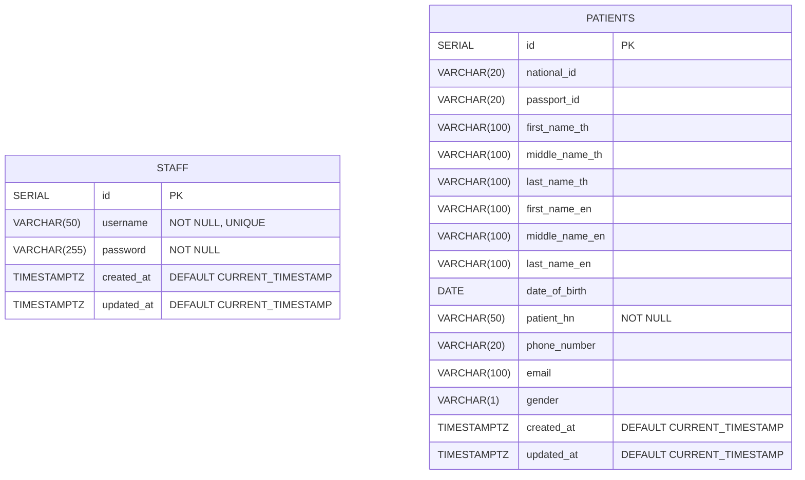

# Hospital Middleware System ER Diagram

## Overview

This document describes the database schema for the Hospital Middleware System (HMS). The system uses PostgreSQL and currently consists of two main tables: Staff and Patients. There is no Hospitals table.

**Related Documentation:**
- [README](../README.md) - Main project documentation
- [API Specification](./api_spec.md) - API endpoints and usage
- [Project Structure](./project_structure.md) - Code organization

## Database Schema Visualization

## Entity Relationships

Staff and Patients are independent entities with no relationships at this time. There is no Hospitals table.

## Indexes

### Staff Table
- Primary Key: `id`
- Unique Index: `(username)`
- Index: `username` (for faster lookups)

### Patients Table
- Primary Key: `id`
- Index: `national_id`
- Index: `passport_id`
- Index: `patient_hn`

## Table Specifications

### Staff Table

| Column | Type | Description | Constraints |
|--------|------|-------------|-------------|
| `id` | SERIAL | Primary key | AUTO INCREMENT |
| `username` | VARCHAR(50) | Staff username | NOT NULL, UNIQUE |
| `password` | VARCHAR(255) | Bcrypt hashed password | NOT NULL |
| `created_at` | TIMESTAMP WITH TIME ZONE | Creation timestamp | DEFAULT NOW() |
| `updated_at` | TIMESTAMP WITH TIME ZONE | Update timestamp | DEFAULT NOW() |

### Patients Table

| Column | Type | Description | Constraints |
|--------|------|-------------|-------------|
| `id` | SERIAL | Primary key | AUTO INCREMENT |
| `national_id` | VARCHAR(20) | Thai national ID | NULL |
| `passport_id` | VARCHAR(20) | Passport ID for foreigners | NULL |
| `first_name_th` | VARCHAR(100) | First name in Thai | NULL |
| `middle_name_th` | VARCHAR(100) | Middle name in Thai | NULL |
| `last_name_th` | VARCHAR(100) | Last name in Thai | NULL |
| `first_name_en` | VARCHAR(100) | First name in English | NULL |
| `middle_name_en` | VARCHAR(100) | Middle name in English | NULL |
| `last_name_en` | VARCHAR(100) | Last name in English | NULL |
| `date_of_birth` | DATE | Date of birth | NULL |
| `patient_hn` | VARCHAR(50) | Hospital number | NOT NULL |
| `phone_number` | VARCHAR(20) | Phone number | NULL |
| `email` | VARCHAR(100) | Email address | NULL |
| `gender` | VARCHAR(1) | Gender (M/F) | NULL |
| `created_at` | TIMESTAMP WITH TIME ZONE | Creation timestamp | DEFAULT NOW() |
| `updated_at` | TIMESTAMP WITH TIME ZONE | Update timestamp | DEFAULT NOW() |

## Business Rules and Constraints

### Staff Table
- `id` is the primary key and auto-increments
- `username` must be unique
- Password must be stored as a bcrypt hash, never in plain text

### Patients Table
- `id` is the primary key and auto-increments
- At least one of `national_id` or `passport_id` must be provided (CHECK constraint)
- `gender` must be either 'M' or 'F' (CHECK constraint)
- `national_id`, `passport_id`, and `patient_hn` are indexed for faster lookups

## Migration Scripts

Migration scripts for creating these tables can be found in the `/migrations` directory:

- `001_create_staff_table.up.sql`
- `002_create_patients_table.up.sql`

## Database Diagram

The Mermaid ER diagram above reflects the current schema defined by the SQL migrations.

